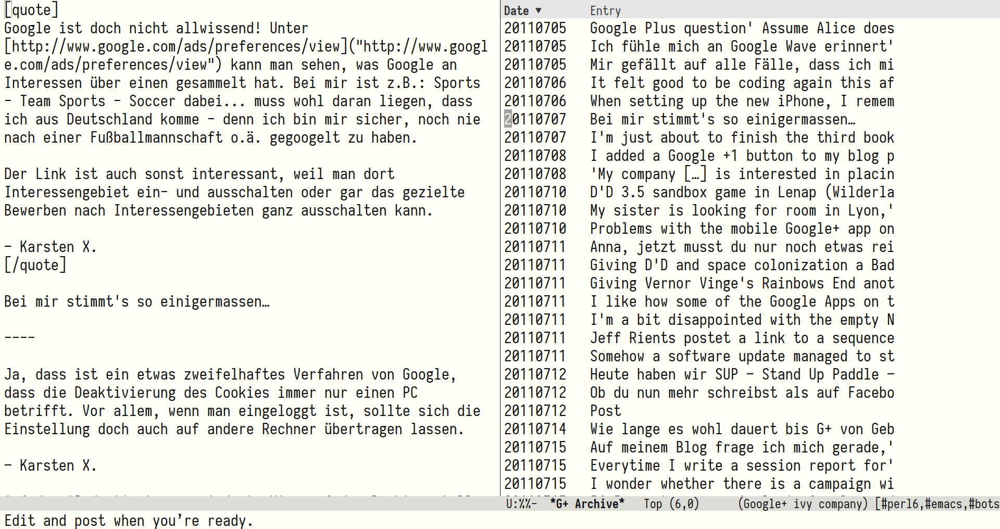

# Google+ Browser

This is code to browse your Google+ Archive. Look at posts you made
and decide what you want to do with them. Currently, the only actions
implemented are:

1. upload post to an [Oddmuse](https://oddmuse.org/) wiki
2. delete post from the archive

Dependencies:

1. `markdown-mode`
2. `html-to-markdown`

This is what the UI looks like:

